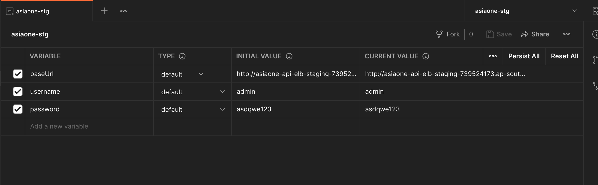
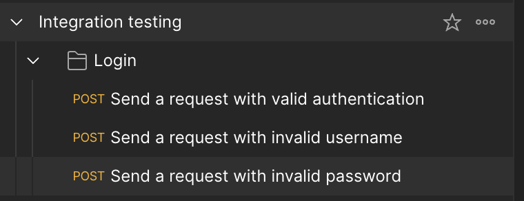
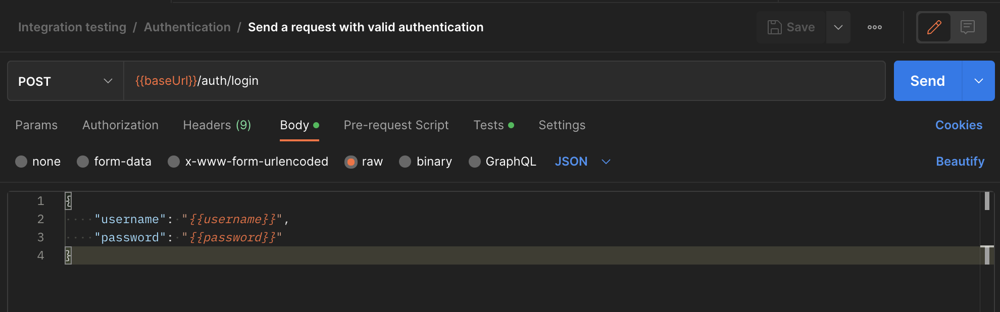
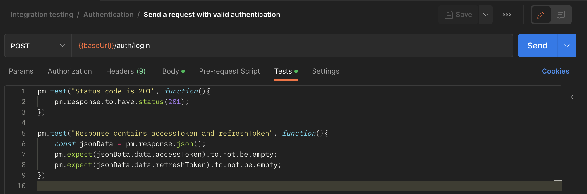
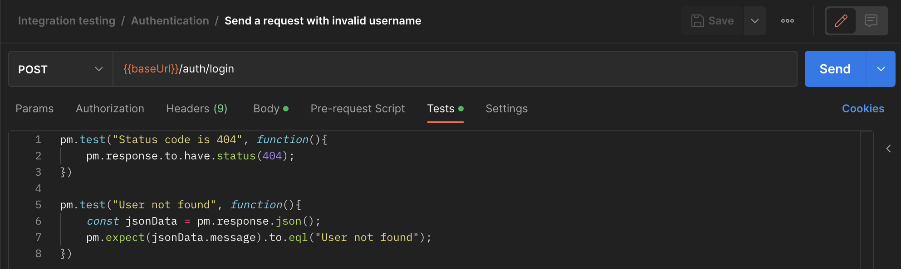
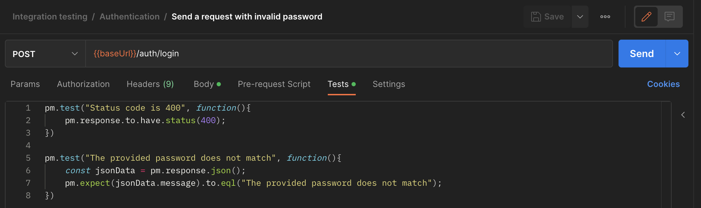
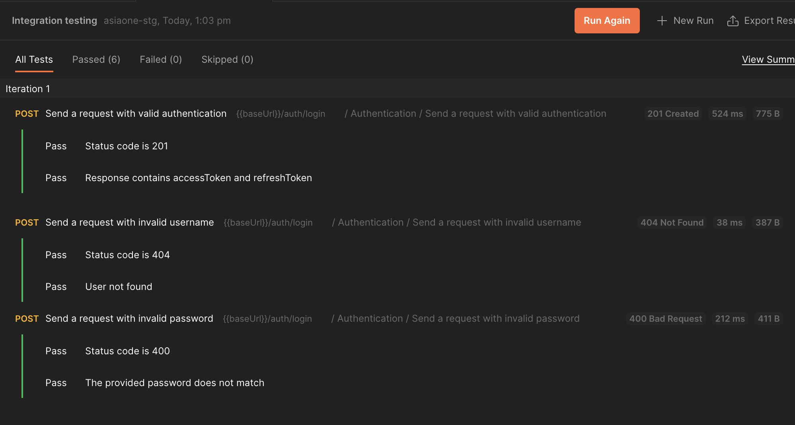

# Integration Testing

Integration testing focuses on verifying the interactions and integration between the web service and other components, such as databases, APIs, external services, or third-party integrations.

## Identify test scenario:

Determine the key functionalities and use cases of your API that need to be tested. This includes both positive and negative scenarios, error handling, and edge cases.

## Design test cases:

Create test cases that cover the identified scenarios. Test cases should include specific requests to the API endpoints and assertions to validate the expected responses.

## Set up test environment and data:

Create a test environment similar to the production environment. This may involve deploying the API to a separate server or using tools like Docker. Also, prepare test data that represents different scenarios and inputs, such as test users or sample data.

## Execute test cases:

Automate the execution of your test cases using a testing framework or tool. You can use popular frameworks like [Postman](https://www.postman.com/), [Jest](https://jestjs.io/) or [JMeter](https://jmeter.apache.org/) for this purpose. Make sure to include a wide range of scenarios to cover different API endpoints, input variations, and error conditions.

## Validate responses:

Verify that the API responses match the expected results. Check the HTTP status codes, response payloads, and any other relevant data returned by the API.

## Record test results:

Keep track of the test cases that were executed, including the specific requests made to the API endpoints and the corresponding responses received. This documentation helps in identifying and reproducing any issues or unexpected behaviors that occurred during testing.

## Integration Testing with Postman:

### Set up test environment:

In this step, create and configure the Postman test environment to set up any necessary variables, configurations, or dependencies required for the integration tests.

### Defining the Tests:

In this step, create requests in Postman to represent integration scenarios. Define the request methods, URLs, headers, and bodies according to the integration requirements.

Use the {{variableName}} syntax in the request body to reference environment variables, enabling value reuse across multiple requests and improving test maintainability and flexibility.

In the "Tests" tab of each request, write JavaScript code to validate the response and define expected results and assertions to ensure the integration is functioning correctly.

### Running tests:

Execute all tests by running the requests in Postman. You can do this by right-clicking on the test collection and selecting "Run collection" This will run all the requests within the collection, allowing you to validate the integration and check the results of each test.

