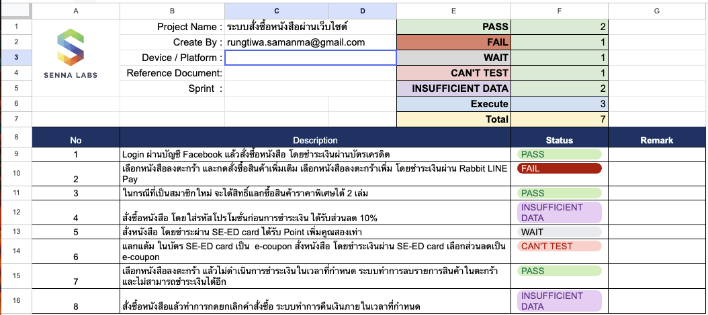

# UI Testing

UI testing is a type of software testing that focuses on the user interface (UI) of an application. It involves testing the application's graphical user interface to ensure that it meets the specified requirements and works as expected.

## The Scope of UI Testing

The scope of UI testing typically includes verifying the functionality and usability of the user interface components. Here are a few essential test cases that UI tests often verify

-   Input Validation: Validate user inputs by testing various scenarios, such as entering valid and invalid data, special characters, long inputs, empty fields, and boundary conditions. Ensure appropriate error messages are displayed for invalid inputs.

-   Layout: Ensure that the UI elements are correctly positioned, aligned, and formatted according to the design specifications. Test for consistent typography, color schemes, and visual hierarchy.

-   Responsive: Test the UI across different browsers, devices, and screen sizes to ensure a consistent and responsive user experience. Check for issues such as layout distortion, overlapping elements, or misaligned content.

-   Navigational elements: The test checks that all navigational buttons on a page are working and that they redirect users to the right page.

-   Progress bars: The test checks that when displaying pages or screens that take time to load completely, a progress bar appears to let the user know that the page is loading.

## UI Testing Approaches

UI tests can be conducted manually or automatically. Testers can make a choice between either technique or implementing both, depending on the nature of the application as well as the team itself.

### Manual Testing

Manual testing is a UI testing approach where testers manually execute test cases without the use of any automation tools. This approach is time-consuming and prone to human errors, but it is useful for testing small applications or features.

### Automated Testing

Automated testing is a UI testing approach where testers use automation tools to execute test cases. This approach is faster and more reliable than manual testing, but it requires more effort to set up and maintain the automation framework.

## Tools and Frameworks for UI Testing

There are various tools and frameworks available for UI testing. Here are some commonly used ones, including [Cypress](https://www.cypress.io/), [Playwright](https://playwright.dev/), [Katalon Studio](https://katalon.com/), [Selenium](https://www.selenium.dev/), and [Robot Framework](https://robotframework.org/)

## Create a test plan

To conduct comprehensive user interface testing, QA teams need to create a test plan that specifies the features of the application or website to be tested. By creating test scenarios, test cases, and test scripts to solve the necessary problems.

### Test scenario

A test scenario is defined as any functionality that can be tested. It is a collective set of test cases that helps the testing team determine the positive and negative characteristics of the project.

#### Tips to create test scenarios

-   Keep the scenario descriptions simple and easy to understand.
-   Carefully assess the stated requirements before creating scenarios.
-   Gather the required tools and resources for testing before initiating the testing process.

### Test case

A test case is a set of actions executed to verify a particular feature or functionality of the software application. It contains test steps, test data and test conditions developed for a specific test scenario to verify any requirement.

#### Tips to create test cases

-   Ensure test cases are simple and clear.
-   Create a test case with the end user in mind.
-   Avoid duplicating test cases unnecessarily.
-   Do not assume functionality and features of your software application while preparing test case. Stick to the Specification Documents.

## Template

<a href="./docs/ui-testing/test_scenario_template.xlsx" download="file.xlsx">Download test scenario template</a>

<a href="./docs/ui-testing/test_case_template.xlsx" download="file.xlsx">Download test case template</a>
